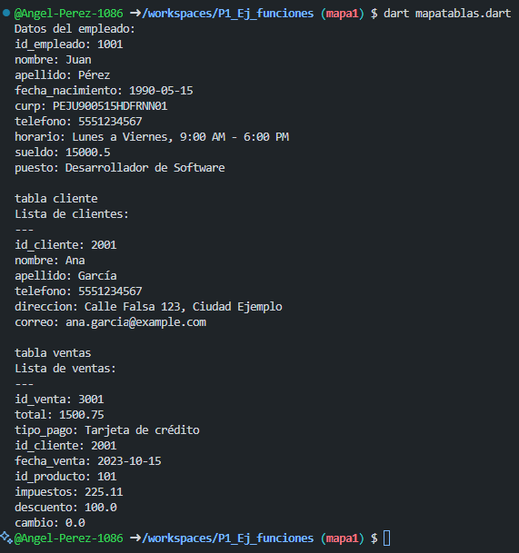

crear map <string, dynamic>  empleados  con los siguientes key, id_empleado, nombre, apellido, fecha de nacimiento, curp, telefono, horario, suledo, puesto. y mostrar los datos con un foreach lenguaje dart.

crear map <string, dynamic>  cliente  con los siguientes key, id_cliente, nombre, apellido, telefono, direccion, correo. y mostrar los datos con un foreach lenguaje dart.

crear map <string, dynamic>  ventas con los siguientes key, id_venta, total, tipo_pago, id_cliente, fecha_venta, id_producto, impuestos, descuento, cambio y mostrar los datos con un foreach lenguaje dart.

